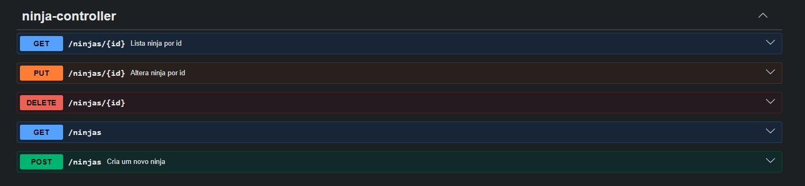
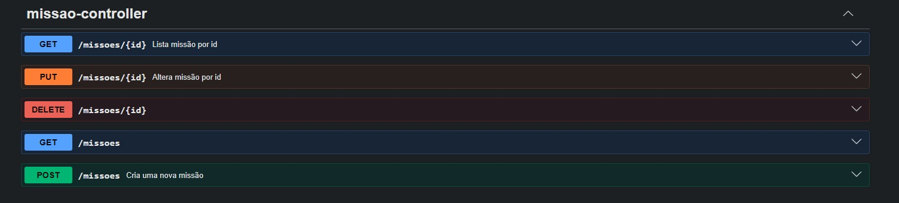
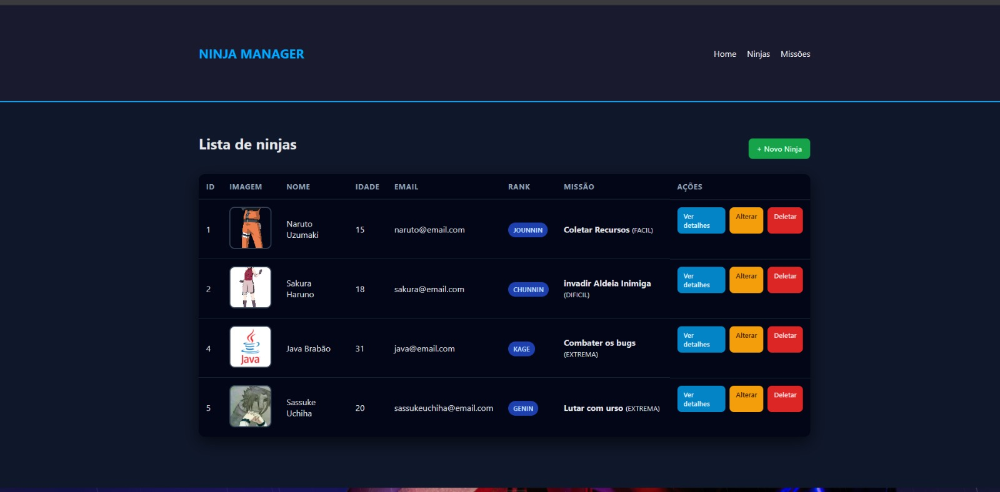

# 🥷 Cadastro de Ninjas & Missões - API RESTful


Esta é uma aplicação completa para gerenciamento de Ninjas e suas respectivas Missões, desenvolvida com o ecossistema **Spring Boot**. O projeto evoluiu de uma estrutura básica para uma arquitetura robusta, focada em padrões de mercado e containerização.

## 🖼️ Demonstração Visual

### Documentação da API (Swagger)
<div style="display: flex; gap: 10px;">
  
  
</div>

### Interface do Usuário (Thymeleaf)


## 🚀 Diferenciais Técnicos (O que aprendi/apliquei)

Nesta etapa do projeto, foquei em elevar a qualidade do código através de:

- **Arquitetura RESTful Real**: Refatoração de todos os endpoints para remover verbos das URLs, utilizando os métodos HTTP (`GET`, `POST`, `PUT`, `DELETE`) de forma semântica.
- **Tratamento de Nulidade com `Optional`**: Implementação do `java.util.Optional` na camada de Service, eliminando retornos nulos e tornando o código resiliente a `NullPointerException`.
- **Persistência com PostgreSQL & Docker**: Migração do banco H2 (em memória) para um banco de dados relacional real rodando em container.
- **Documentação com Swagger (OpenAPI 3)**: Documentação interativa completa para teste dos endpoints, com descrições detalhadas de operações e respostas.
- **Padrão DTO & MapStruct**: Separação clara entre as entidades do banco de dados e os objetos de transferência de dados (DTOs).

## 🛠️ Tecnologias Utilizadas

- **Backend**: Java 17, Spring Boot 3, Spring Data JPA.
- **Banco de Dados**: PostgreSQL.
- **Containerização**: Docker e Docker Compose.
- **Documentação**: SpringDoc OpenAPI.
- **Interface**: Thymeleaf (SSR) para a camada de UI.

## 📦 Como Executar o Projeto

Certifique-se de ter o **Docker Desktop** instalado e rodando.

1. Clone o repositório:
   ```bash
   git clone [https://github.com/ivanmtr/CadastroDeNinjas.git](https://github.com/ivanmtr/CadastroDeNinjas.git)